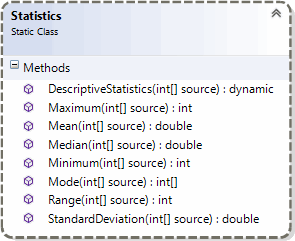

# 1 - Skarp beskrivande statistik

- Examinationsuppgift 1

> __VIKTIGT!__ Innan du börjar arbeta med examinationsuppgiften är det viktigt att du lägger till examinationsuppgiftens repo till ditt repo för examinationsuppgiften.

***

## OBS! OBS! OBS!

- Detta är en **obligatorisk** och **examinerande** uppgift som **du ska lösa helt på egen hand**.
- Du måste göra **regelbundna "commits" och "pushes"** av koden till ditt repo för uppgiften för att kursledningen ska kunna följa ditt arbetet med uppgiften.
- Du ska kunna förklara alla konstruktioner och satser som din lösning av uppgiften innehåller.

***

## Introduktion

I denna examinationsuppgift ska du skapa en konsolapplikation i C# vars syfte är att presentera beskrivande statistik över stora datamängder.

Beskrivande statistik (eller _deskriptiv statistik_; eng. "_descriptive statistics_") är ett sätt att reducera stora datamängder för att presentera en sammanfattning av datamängden.

## Uppgift

Din uppgift är att skriva en konsolapplikation som tar en JSON-fil med heltal som argument och sammanfattar datamängden i filen och ger lättöverskådlig vy av datamängden.

### Klassen `Statistics`

Applikationen ska innehålla en statisk klass, `Statistics`, vars statiska metoder reducera datamängden i form av en samling med heltal av typen `int` som skickas till metoderna i klassen.



_Figur 1. Klassdiagram över den statiska klassen <code>Statistics</code>._

Klassen ska ha statiska metoder för att bestämma maximum- och minimumvärden, variationsbredd (_range_), medelvärde (_mean_), median, standardavvikelse (_standard deviation_) samt typvärde (_mode_, som kan vara en samling med värden).

- De publika statiska metoderna ska implementeras enligt signaturerna i klassdiagrammet i figur 1.

- Medlemmar i klassen `Statistics` får inte ha några sidoeffekter. Metoder ska vara så kallade _pure methods_.

- Medlemmar i klassen klassen `Statistics` ska kasta undantag (men inte fånga några!).

- Anropas någon av de statiska metoderna i klassen `Statistics` med argumentet `null`ska ett undantag av typen `ArgumentNullException` kastas.

- Anropas någon av de statiska metoderna i klassen `Statistics` med ett argument som som refererar till en tom samling, ska ett undantag av typen `InvalidOperationException` kastas innehållande meddelandet "_Sequence contains no elements_".

### Övriga klasser

Det står dig fritt att skapa egna statiska klasser för t.ex. applikation, hantering av persistent data, presentation av data, etc.

### Allmänna krav

- Applikationen får endast innehålla statiska klasser och medlemmar.

- Skriva inte all kod som krävs för att lösa problemet i en enda statisk klass och/eller metod. Se till att dela upp lösning av problemet i lämpliga statiska klasser och metoder du själv skapar (_"separation of concern"_).

- Undvik att upprepa kod och bryt därför inte mot principen DRY (_"don't repeat yourself"_).

- Presentationen av den beskrivande statistiken ska vara lättöverskådligt och lättförstålig. Flyttal ska presenteras med en decimals noggrannhet.

```shell
Maximum : 378
Minimum : -42
Medelvärde : 167,3
Median : 165
Typvärde : 31, 87, 228
Variationsbredd : 420
Standardavvikelse: 122,3
```

_Figur 2. Exempel på presentation._

- Anropas applikation med JSON-filer innehållande data enligt nedan ska applikationen på lämpligt sätt presentera sammanfattningen:

- `[ 4, 8, 2, 4, 5 ]` ska ge <br />`{ Maximum: 8, Mean: 4.6, Median: 4, Minimum: 2, Mode: { 4 }, Range: 6, StandardDeviation: 1,95959179422654 }`

- `[ 4, 2, 6, 1, 3, 7, 5, 3, 7 ]` ska ge <br />`{ Maximum = 7, Mean = 4,22222222222222, Median = 4, Minimum = 1, Mode = { 3, 7 }, Range = 6, StandardDeviation = 2,0427529234278 }`.

- `[ 5, 1, 1, 1, 3, -2, 2, 5, 7, 4, 5, 16 ]` ska ge <br />`{ Maximum = 16, Mean = 4, Median = 3,5, Minimum = -2, Mode = { 1, 5 }, Range = 18, StandardDeviation = 4,32049379893857 }`.

- Innehåller i `data.json` ska ge <br />`{ Maximum = 378, Mean = 167,3088, Median = 165, Minimum = -42, Mode = { 31, 87, 228 }, Range = 420, StandardDeviation = 122,30587738355 }`.

## Tips

- [Medelvärde, median, typvärde och variationsbredd](http://www.matteboken.se/lektioner/matte-1/sannolikhet-och-statistik/medelvarde-median-typvarde-och-variationsbredd)
- [Standardavvikelse](http://www.matteboken.se/lektioner/matte-2/statistik/standardavvikelse)
- Kanske ska du ta dig en titt på LINQ?
- Vill du verkligen utmana dig själv kan du välja att implementera saknade aggregatsmetoder som så kallade utökningsmetoder (eng. "extension methods").
- Du använder lämpligen klassen `JsonConvert` för att tolka JSON-data. För att kunna använda `JsonConvert` måste du lägga till paketet `NewtonSoft.Json`med `dotnet add package newtonsoft.json`.
